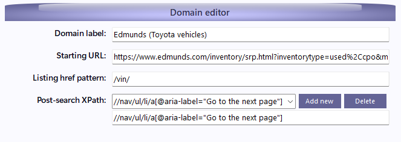
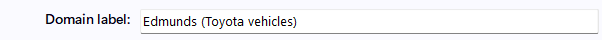
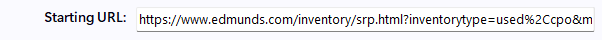
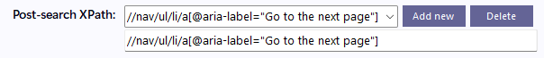
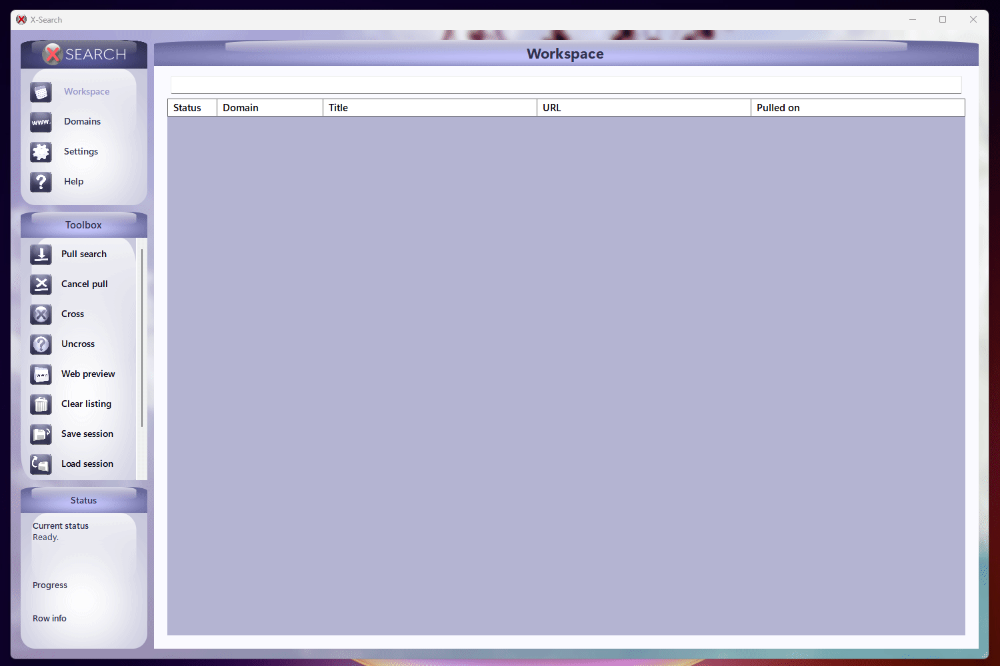
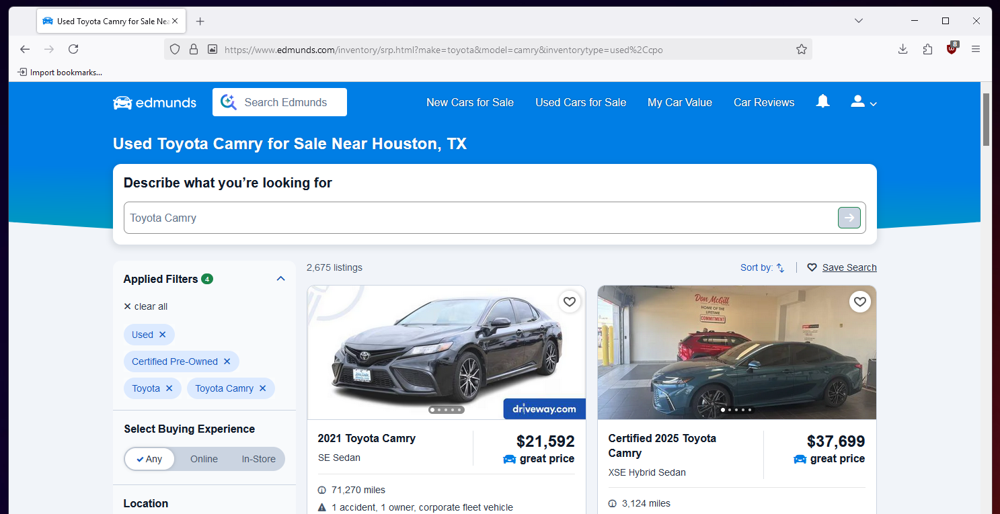
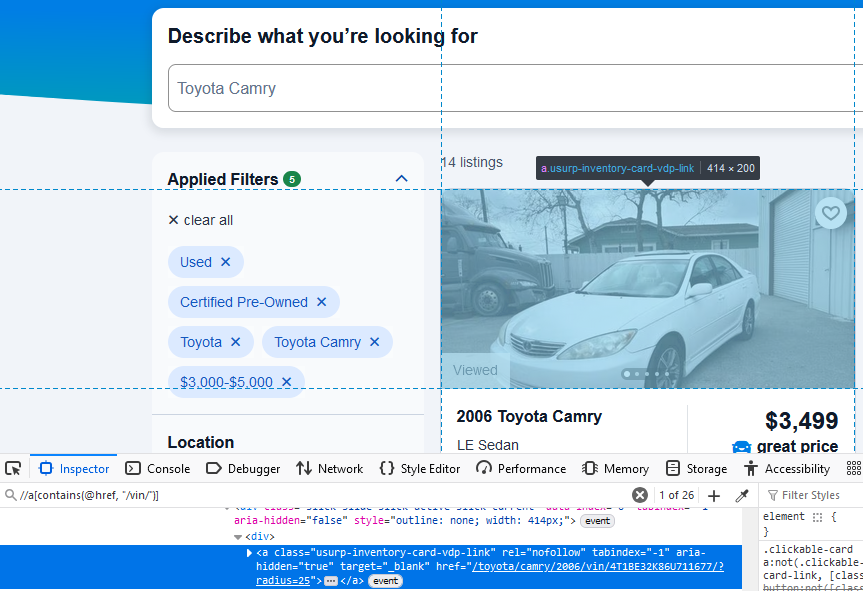
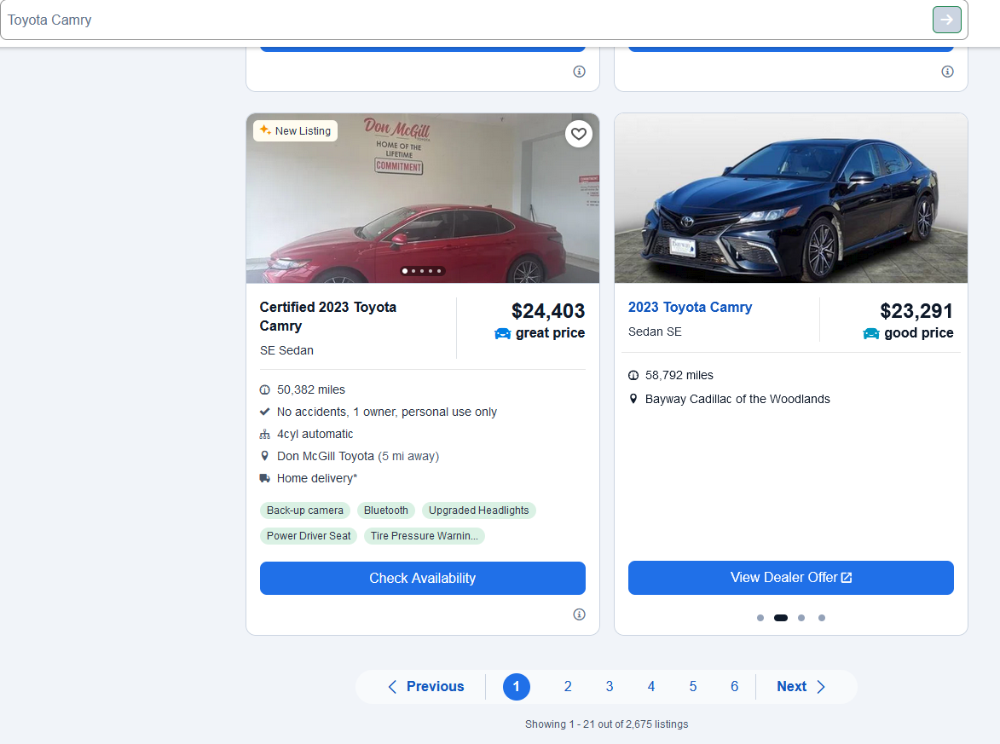
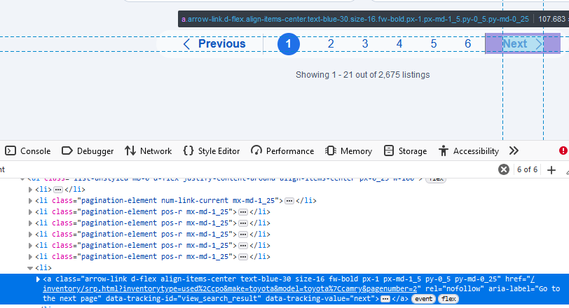

# Configuring new domains

<p>
    
</p>

X-Search lets you configure new domains to pull from based on general patterns. This lets you hypothetically query any domain.

Be warned - **configuring your own domains will require troubleshooting and some specific technical skills.** Familiarity with HTML, xpath and regular expression will be helpful. 

# The Process of Pulling

Before configuring any domains, it's important to understand how X-Search actually performs its pulls. 

Here's a simplified overview. We'll refer back to these search steps by number in the next section.

1. For each active domain, create a webdriver - basically a live simulation of a web browser. 

2. Build the domain's starting URL, then navigate the webdriver to it.

3. Query the HTML of the starting page for anchor elements that resolve to valid listings.

4. Open listing links, collating them into search listings delivered to the workspace.

5. When no more matching links can be found in step 3, look for elements to click that might reveal more results.
    - These are defined by users. They might be "next page" buttons, close buttons for popups, or otherwise.
    - After clicking, the process will repeat from step 3.


# Domain editor fields explained

## Domain label

<p>
    
</p>

A label for your own identification of this domain. Change it to whatever you'd like.

## Starting URL

<p>
    
</p>

The URL X-Search will navigate to in search step #2.

``<<searchTerm>>`` serves as a placeholder string for your search term. X-Search will automatically replace instances of ``<<searchTerm>>`` with your search term when building URLs. 

If you add multiple instances of ``<<searchTerm>>``, X-Search will attempt to replace each instance with words delimited by spaces in your search term. If the number of placeholders doesn't match the number of delimited words, the full search term will be placed in each placeholder. 
- Search term ``honda civic`` substituted into ``<<searchTerm>><<searchTerm>>`` will resolve into ``honda civic``.
    - The same search term substituted into ``<<searchTerm>>`` would also resolve as ``honda civic``.
    - Meanwhile, substituting the term into ``<<searchTerm>><<searchTerm>><<searchTerm>>`` would resolve as ``honda civichonda civichonda civic``.
- This feature is slated for a redesign to allow users to specify their own placeholders in the pull menu.

You can determine this field by making a search on the target domain, then modifying the returned URL.

## Listing href pattern

<p>
    
</p>

A regular expression escape sequence, used to identify item listings in search step #3.

Specifically, X-Search matches this sequence in the href attributes of any anchor elements in the source HTML.

You can generally determine this field by going to any example of a target listing, then finding a pattern in their URLs that is common to all listings. 
- All eBay item pages, for example, have /itm/ in their URL.
- On some domains, the URL of the href is not the same as the URL of the listing. You might need to inspect the HTML to find matching anchors/hrefs to determine the pattern.

## Post-search xpath

<p>
    
</p>

An xpath query that identifies clickable HTML elements that may reveal more search results during search step #5. 

Multiple queries can be specified. X-Search will run all of them if it can't find any more elements during search step #2. 

This field can only be determined by inspecting the HTML of a search page, finding relevant elements, and crafting a query that matches them. Practical examples will be shown in the next section.

# Full example
Let's go through the full process of configuring a domain. We'll use Edmunds.com as an example, but the same basic process applies to any domain. 

Open the domains menu from the menu panel. Select "Add domain" from the toolbox, then fill in the label as appropriate.

<p>
    
</p>

## Starting URL
Open your target domain in your favor browser and try searching for your target. Let's look for "Toyota Camry," making sure to adjust the filters as we see fit. 

<p>
    
</p>

We searched for a make and model and specified to only include used cars, resulting in this URL:

> ``https://www.edmunds.com/inventory/srp.html?make=toyota&model=camry&inventorytype=used%2Ccpo``

Let's also say we're working with a budget of $5,000. We thus adjust the target price filter to 3,000-5,000. This changes the URL again:

> ``https://www.edmunds.com/inventory/srp.html?inventorytype=used%2Ccpo&make=toyota&model=toyota%7Ccamry&price=3000-5000``

It's important to note that if your domain's search URLs don't change responsively like this, X-Search likely won't be able to replicate your query while pulling. Otherwise, you're good to go.

Now we need to substitute ``<<searchTerm>>`` in appropriate places, as shown below:

> ``https://www.edmunds.com/inventory/srp.html?inventorytype=used%2Ccpo&make=toyota&model=<<searchTerm>>|<<searchTerm>>&price=3000-5000``

And there we have it - our **Starting URL** field for any Toyota-brand vehicles. 

## Listing href pattern

Next we need a listing href pattern. Clicking on any of the listings our previous search returned gives us URLs like this:

> ``https://www.edmunds.com/toyota/camry/2006/vin/4T1BE32K86U711677``
> ``https://www.edmunds.com/toyota/camry/1999/vin/4T1BG28K7XU584787``
> ``https://www.edmunds.com/toyota/camry/2005/vin/4T1BE30K65U584624``

There's a few common patterns here, but the most generic and reliable seems to be `/vin/`. Let's run some XPath to verify that the underlying HTML listing elements reflect this convention. 

`//a[contains(@href, "yourstring")]` (where `yourstring` is the working pattern) tends to work well:

<p>
    
</p>

Looks like a success! Our **listing href pattern** is thus `/vin/`.

Not all domains are this simple, though. If you don't get a match for your xpath, you may have to search the document for the anchor elements of a listing and examine its href attribute.

# Post-search XPath

<p>
    
</p>

Edmunds delivers its results in pages, which means we'll need XPath queries to let X-Search use the "next page" button. To identify the element with XPath, we'll need to examine the search page's HTML, so let's open the inspect element pane.

General advice for searching HTML applies here. In our case, we're looking for the "next page" button, which is often found among elements referencing ``pagination``. Searching the HTML for this line quickly reveals our target element:

<p>
    
</p>

Now we have to actually write the xpath query in question.

Since the query will be run very infrequently, and over (relatively) small documents, it doesn't need to be efficient. Thus, pretty much all of our queries can look something like...

```xpath
//a[@aria-label="Go to the next page"]
```
Where...
- ``//`` is the relative path selector, querying every node in the entire document.
- ``aria-label`` is the name of an identifying attribute on the target element. Anything works, so long as it's unique and unlikely to change.
- ``"Go to the next page"`` is the value of the identifying attribute.

And that's our xpath field! Bear in mind that you might need to define more than one for other domains.

## Testing your domain

<p>
    
</p>

If all has gone well, your domain should be ready to use! You can now enable it for pulling and try it out. 

While testing new domains, it's recommended to disable headless browsing through the program's settings to see the program work in real time. You should also pay attention to the program's status update messages for any errors. Make sure it's successfully grabbing listings and using any of the xpath queries you defined.