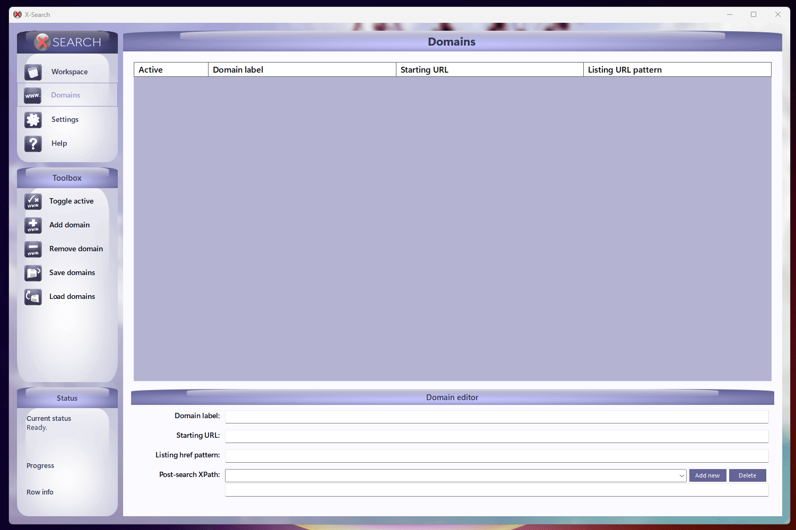
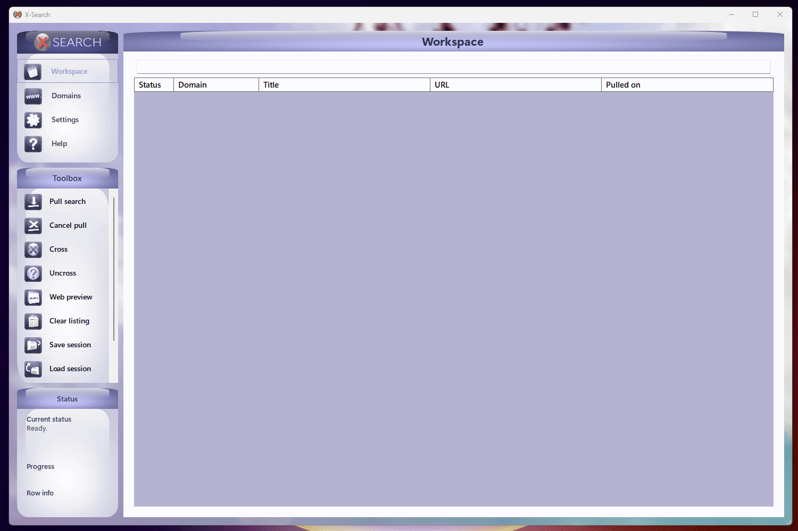
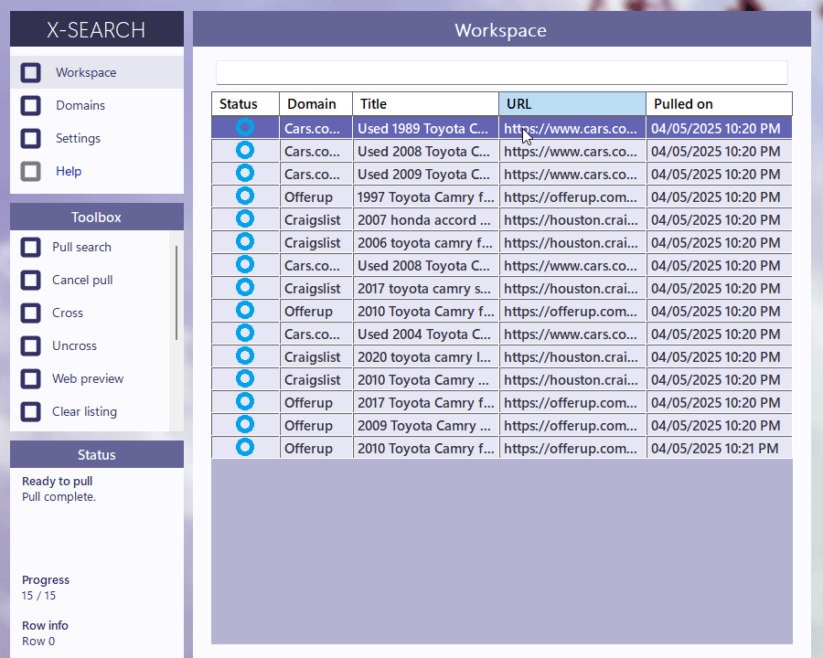
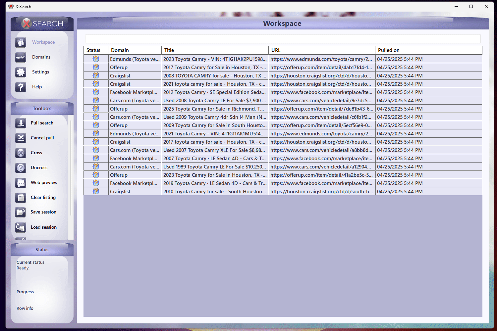

# Quickstart

To get started with X-Search, you'll first need some domains to pull from. Let's open the Domains panel from the top left.

    

[Configuring your own domains](Configuring%20domains.md) is totally possible, but can get a bit complicated. You'll likely need to adjust the search URLs to suit your actual location and verify that you can resolve them in a browser.

For demo purposes, just use the toolbox on the left to load a domain profile. X-Search comes packed with a selection of preset sample domains to get you started.

    

You can enable domains by selecting them and pressing the button from the toolbox. Pressing the spacebar does the same. For demonstration, we'll select all the vehicle-related domains.

Now let's return to the Workspace and start a pull. Let's say we're looking for a Toyota Camry and want to pull only the first 50 results from each domain.

It will take the program a minute to start delivering results. But once it does, they'll fill in rapidly.

    

You can start evaluating results as soon as they start coming in. 

Pressing enter on selected entries will open them into your default browser. You can also pop a web preview from the toolbox, which will automatically load your first selected listing. It's very handy for rapid evaluation.

    

Once you've finished an evaluation, it's time to cross the listing out.

You can cross entries with the toolbox button or by pressing Control + Space. Crossing an entry drops it to the bottom of the list - out of sight, out of mind. 

Crossing is the heart of X-Search; by crossing an entry, you're telling yourself that you've finished evaluating a listing.

    

By default, when you close X-Search creates an autosave of your last domain profile and session results. The program will also to automatically load these autosaves on startup. 

Note that autosave can be disabled in the settings menu. You can at any time force an autosave/load with the quick save/quick load options from the workspace toolbox. 

For most users, autosaving is enough. But if you're managing multiple searches at once (or just want backups), you can save and load sessions and domain profiles with the respective buttons.

    

The basics of X-Search are now open to you. Keep pulling, evaluating, and crossing until you find that white whale!