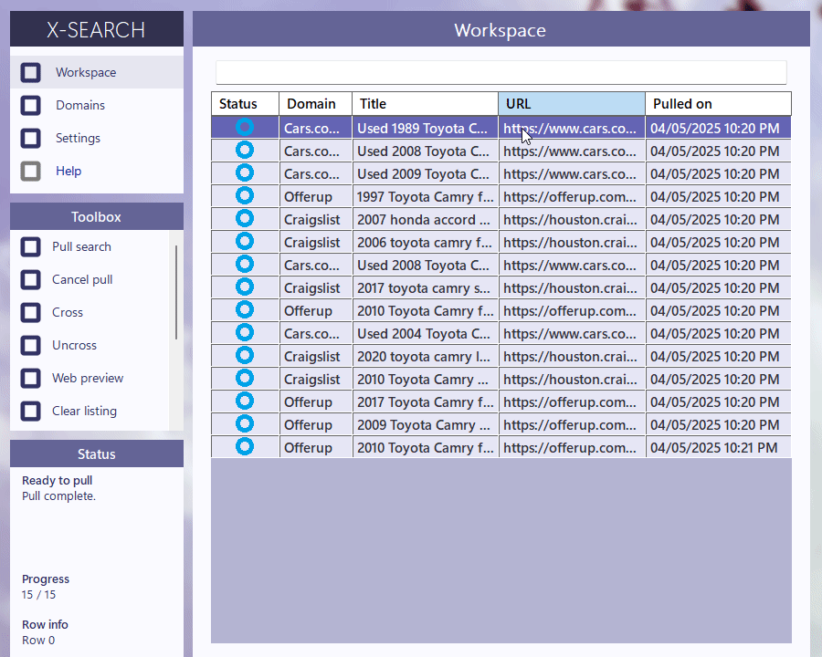

# X-Search

    

X-Search (pronounced "cross search") is a tool for aggregating and decluttering search results from across the Internet. 

X-Search is designed with a few key objectives in mind:
- Focusing searches only on evaluations that still need to be made

- Rapidly eliminating undesirable search results

- Facilitating long-term searches made across multiple sessions

- Easing searches in volatile, high-investment markets (used vehicles, housing, employment, etc.)

In X-Search, results are **persistent across sessions.** This is thanks to an additive search process termed "pulling." A pull doesn't discard previous search results as is typical for a search engine. Instead, each new query simply returns whichever results aren't already in your workspace. 

# Quickstart

To get started with X-Search, you'll first need some domains to pull from. Let's open the Domains menu.

    

Configuring your own domains is totally possible, but can get a bit complicated. 

For now, just use the toolbox on the left to load a domain profile. X-Search comes packed with a selection of preset sample domains to get you started.

    

The domain editor shown lower down is, again, a fairly advanced feature. That being said, you'll likely need to adjust the search URLs to suit your actual location. Hovering over labels will pop explanatory tooltips. 

You can enable domains by selecting them and pressing the button from the toolbox. Pressing the spacebar does the same. For demonstration, we'll select all the vehicle-related domains.

Now let's return to the Workspace and start a pull. Let's say we're looking for a Toyota Camry and want to pull only the first 25 results from each domain.

It will take the program a minute to start delivering results. But once it does, they'll fill in rapidly.

    

You can start evaluating results as soon as they start coming in. 

Pressing enter on selected entries will open them into your default browser. You can also pop a web preview from the toolbox. This will automatically load the first entry in your selection - very handy for rapid evaluation.

    

Once you've finished an evaluation, it's time to cross the listing out.

You can cross entries with the toolbox button or by pressing Control + Space. Crossing an entry drops it to the bottom of the list - out of sight, out of mind. 

Crossing is the heart of X-Search; by crossing an entry, you're telling yourself that you've finished evaluating a listing.

    

When you close X-Search, an autosave of your last domain profile and session results are saved. This will be automatically loaded on startup, unless you disable the relevant setting. You can also force an autosave/load with the quick save/quick load options from the workspace toolbox.

For most users, autosaving is enough. But if you're managing multiple searches at once, you make separate saves of your sessions, then load them with the respective button.

    

The basics of X-Search are now open to you. Keep pulling, evaluating, and crossing until you find that white whale!

For more information on the domain editor and other advanced program features, see [advanced usage.](Advanced%20Usage.md)